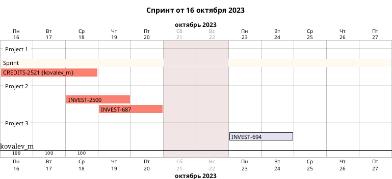

#plantuml #gantt
Example:

```plantuml
@startgantt
language ru
title Спринт от 16 октября 2023
Project starts 2023-10-16
printscale daily zoom 4
-- Project 1 --
saturday are closed
sunday are closed
[Sprint] starts 2023-10-16 and lasts 2 week and is colored in floralwhite
[CREDITS-2521] on { kovalev_m } starts 2023-10-16 and ends 2023-10-18 and is colored in salmon
-- Project 2 --
[INVEST-2500] starts 2023-10-18 and ends 2023-10-19 and is colored in salmon
[INVEST-687] starts 2023-10-19 and ends 2023-10-20 and is colored in salmon
-- Project 3 --
[INVEST-694] starts 2023-10-23 and ends 2023-10-24
@endgantt
```